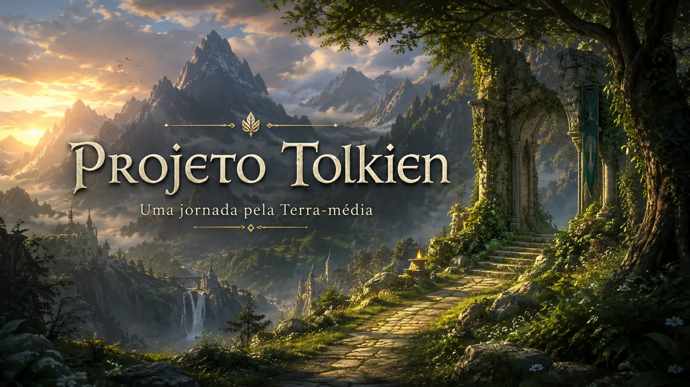

# Projeto Tolkien



Mini site desenvolvido em HTML e CSS com o tema inspirado no universo de J.R.R. Tolkien, especialmente em elementos da Terra-média, suas histórias, personagens e ambientação fantástica.

## Acesse o projeto

O site está publicado pelo GitHub Pages:

https://andyinthenw.github.io/projeto-tolkien/index.html

## Sobre o projeto

Este projeto foi criado com fins de estudo e prática de desenvolvimento web.
A proposta é apresentar um mini site simples, organizado em páginas HTML interligadas, utilizando estrutura semântica, navegação, imagens, listas, seções e estilização com CSS.

## Estrutura do site

O projeto contém as seguintes páginas:

* `index.html` — página inicial do site
* `sobre.html` — página com informações sobre o tema
* `contato.html` — página de contato
* `assets/` — pasta destinada a imagens, ícones e outros arquivos visuais

## Tecnologias utilizadas

* HTML5
* CSS3
* Git
* GitHub
* GitHub Pages

## Objetivo

O objetivo principal do projeto é praticar conceitos básicos de desenvolvimento web, como:

* Estruturação de páginas HTML
* Uso de tags semânticas
* Criação de menus de navegação
* Organização de arquivos
* Publicação de projeto com GitHub Pages
* Versionamento com Git

## Como visualizar localmente

Para abrir o projeto no computador:

1. Clone o repositório:

```bash
git clone https://github.com/AndyinTheNW/projeto-tolkien.git
```

2. Acesse a pasta do projeto:

```bash
cd projeto-tolkien
```

3. Abra o arquivo `index.html` no navegador.

Também é possível usar a extensão **Live Server** no VS Code para visualizar o site localmente.

## Autor

Desenvolvido por **AndyinTheNW**.
